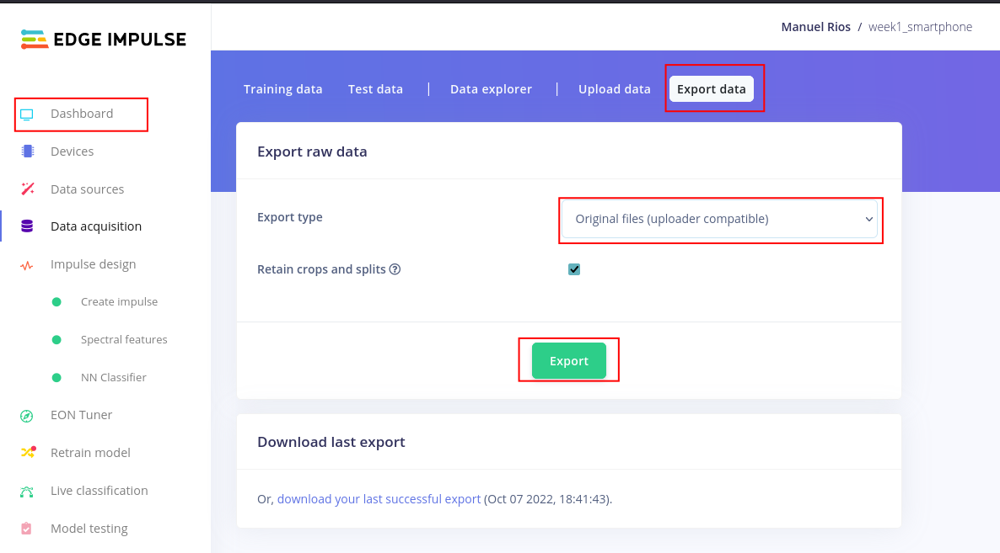

# Data Processing

### Clone the Repository

Clone the Edge Impulse Processing Blocks repository:

```shell
git clone https://github.com/edgeimpulse/processing-blocks.git
```

A folder named `processing-blocks` will be created. Go inside this folder.

### Edit the Repository

Copy the `common` folder inside `spectral-analysis` .

Go inside the `spectral-analysis` folder and edit the `Dockerfile` with the following code on line `23`

```dockerfile
COPY common /common
```

Edit the `dsp.py` file on line `366` by adding a `False` parameter a the end of `generate_features` call.

```python
processed = generate_features(2, args.draw_graphs, raw_features, raw_axes, args.frequency, args.scale_axes, args.filter_type, args.filter_cutoff,
            args.filter_order, args.fft_length, args.spectral_peaks_count, args.spectral_peaks_threshold, args.spectral_power_edges, args.do_log, False)
```

### Docker

Build the Docker file by running

```shell
docker build -t dsp_server .
```

`-t dsp_server` is a name tag that we will bring to our Docker container.

To start the web server run

```shell
docker run -it --rm -p 4446:4446 dsp_server
```

and to stop it type `ctrl+c` in the terminal.

To run the container and use the shell

```shell
docker run -it --rm --entrypoint=bash dsp_server
```

and to stop it type `ctrl+c` in the terminal.

### Test DSP Server

To test your `dsp.py` script inside the Docker shell run

```bash
python3 dsp.py \
--features '-1, 0.4, 11.5' \
--axes 3 \
--frequency 62.4 \
--draw-graphs true
```

You can make a call to your DSP web server through an API call by using the `scripts/simple_request.py` script. By default the server's address is `http://localhost:4446/run`

### Data

A folder named `data` is provided as reference for your implementation. To generate the dataset for your neural network a script called `get_data.py` is provided in the `scripts` folder. When running this script, two files are created:

* A `data/training_data.csv` where your training data is saved.

* A `data/testing_data.csv` where your test data is saved.

Remember that you need to have your DSP web server running to be able to run the `get_data.py` script.

To export your data from Edge Impulse go to your project's `Dashboard`, select `Export data` and in the Export type select `Original files (uploader compatible)` finally click `Export`.



### Train the model

Now you can start to train a neural network with your features already processed!


